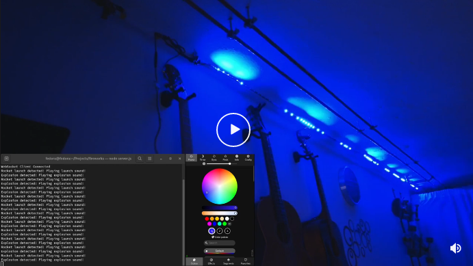

## Demo
[](https://www.reddit.com/r/WLED/comments/rtj4yd/you_may_ban_fireworks_but_you_cant_keep_me_from/)  

# Prerequisites
- A device (Windows, Linux, Mac) with speakers attached
- NodeJS
- An ESP8266 flashed with the WLED firmware
- A supported LED strip (e.g. ws2812b) connected to the ESP8266

## Installation
```
git clone https://github.com/T-vK/WLED-Fireworks-Sound-Effect-Companion.git
cd WLED-Fireworks-Sound-Effect-Companion
npm ci
```
Download your favorite rocket launch and explosion sound effects,
place them in the `WLED-Fireworks-Sound-Effect-Companion` directory and
name them `explosion.mp3` and `launch.mp3`.

## Configuration
Change the IP address in the server.js file to the IP address of your ESP8266.

## Starting the companion
```
node ./server.js
```
